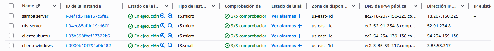
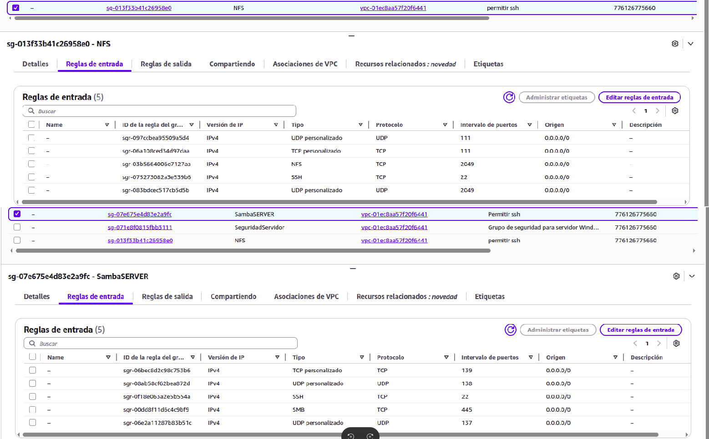
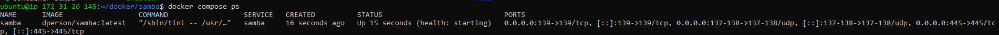
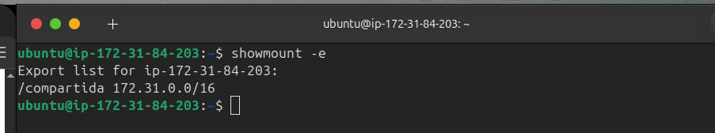
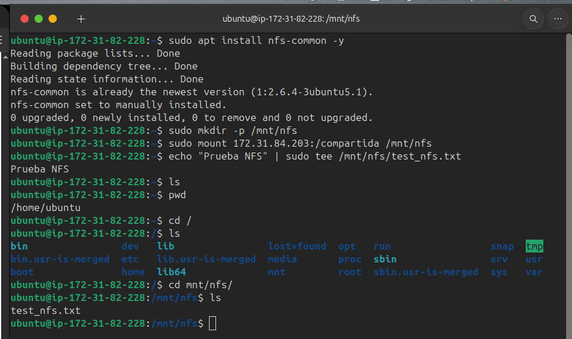
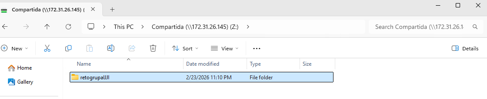

# Documentación del Reto ASO: Infraestructura AWS y Servicios de Archivos

Este documento recoge las evidencias de la implementación de la infraestructura desplegada en Amazon Web Services (AWS) y la configuración de los servicios de red (Samba y NFS) solicitados en el reto.

---

## 1. Infraestructura en AWS

### 1.1. Instancias desplegadas
Se han creado las instancias necesarias en EC2 para simular el entorno de servidor y clientes.

> **Captura requerida:** Panel de instancias de AWS mostrando las máquinas en ejecución.

### 1.2. Configuración de Red y Seguridad
Se han configurado los **Security Groups** para permitir el tráfico necesario en los puertos de los servicios (SSH, SMB para Samba, y los puertos RPC/NFS).

> **Captura requerida:** Reglas de entrada (Inbound rules) de los Security Groups configurados.

---

## 2. Estado de los Servicios

### 2.1. Servicio Samba (Docker)
El servicio Samba se encuentra desplegado y en ejecución mediante contenedores.

> **Captura requerida:** Salida del comando `docker compose ps` verificando el estado del contenedor.

### 2.2. Servicio NFS
El servidor NFS está activo y exportando los directorios configurados.

> **Captura requerida:** Salida del comando `showmount -e` o `exportfs` mostrando los recursos compartidos.

---

## 3. Pruebas de Conectividad y Acceso

### 3.1. Acceso desde Cliente Linux
Se ha verificado el acceso a ambos servicios desde la instancia Linux. En las capturas se observa tanto el montaje exitoso como la creación de los archivos de prueba iniciales para validar permisos de escritura.

> **Captura requerida:** Montaje y acceso al recurso compartido **Samba**.

> **Captura requerida:** Montaje y acceso al recurso compartido **NFS**.

### 3.2. Acceso desde Cliente Windows
Verificación de acceso al recurso compartido Samba desde la instancia cliente Windows, comprobando la visibilidad y capacidad de edición de los archivos.

> **Captura requerida:** Explorador de archivos o terminal de Windows accediendo al recurso compartido.

